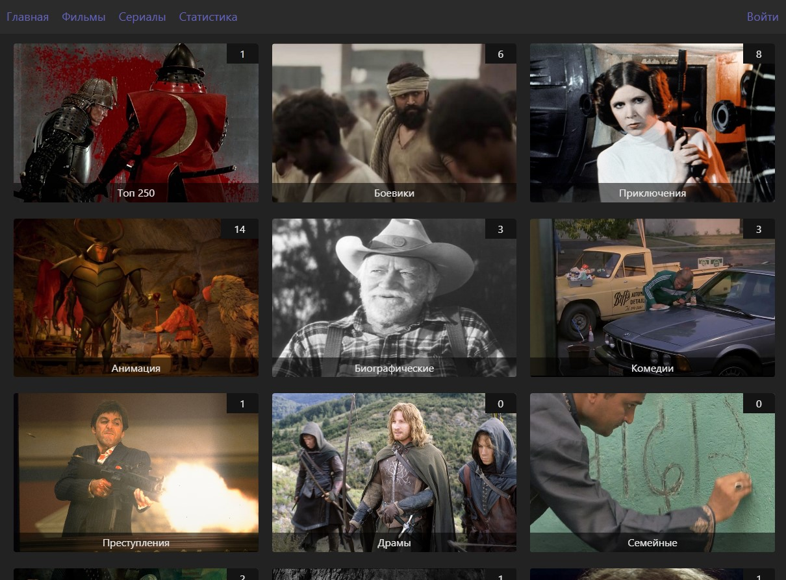
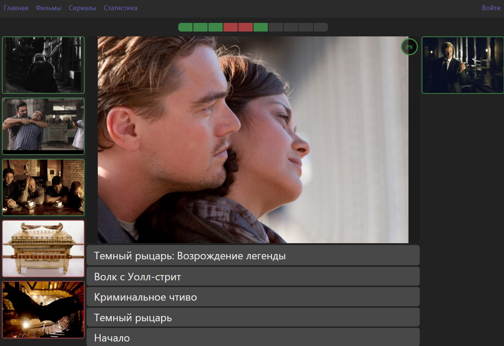
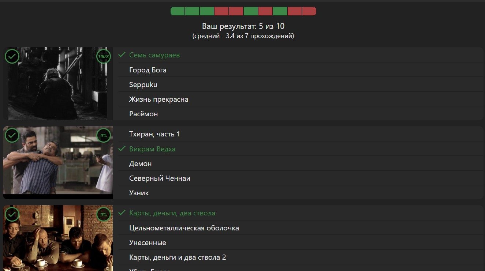

## Автор
- Miasnikov Dmitrii
- email: miasnikovdmitrii@gmail.com

## Описание
Сайт - Тесты по фильмам (картинка и 5 вариаантов ответа)

## Используемые технологии
- Проект написан на TypeScript, React, Redux с применением Hooks, SCSS, ES6
- Используется База данных MongoDB
- api написано на express лежит в отдельном репозитории https://github.com/DmitriiMiasnikov/quiz_films_api

## Функциональные возможности
- В проекте около 20 тестов по разным жанрам, в каждом тесте всего 50 фильмов, но дается случайные 10
- Для каждого шага теста 5 вариантов ответа
- Результат сохраняется и отображается по завершению теста в виде списка с помеченными правильными/неправильными ответами
- по каждому фильму сохраняется статистика: сколько в процентах ответили верно, так же по каждму тесту в целом сохраняется статистика, на какую оценку был завершен тест

## Демо
ссылка на проект на хероку:
https://quiz-27.herokuapp.com/list/films

## Запуск
```npm run start```

## Скриншоты
[](скриншот)
[](скриншот)
[](скриншот)
